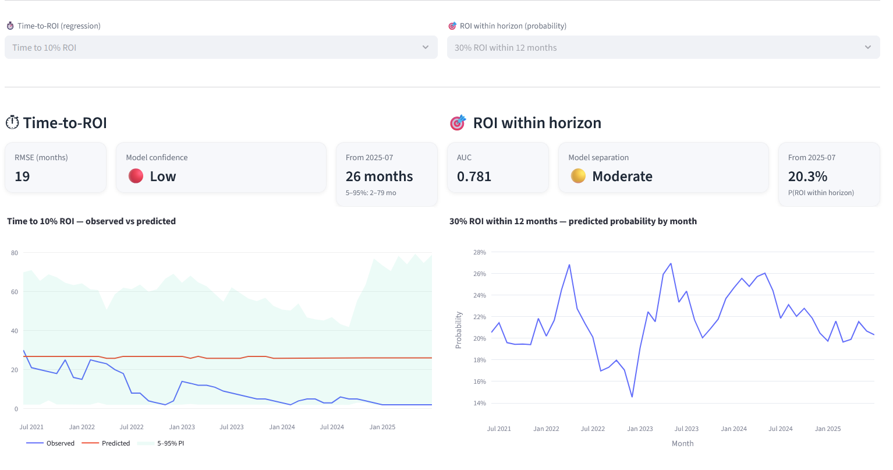

# **⏱️ Gold ROI Forecasting Model**

*Predicting how long it takes to reach a given return on investment in gold, based on historical price dynamics.*

This project estimates:

1. **Time-to-ROI (Regression)**

> *How many months until the price of gold reaches +X% return?*

2. **Probability of achieving ROI within a defined horizon (Classification)**

> *What is the probability of reaching +X% ROI within Y months?*

It is built on:

* **Historical monthly gold prices**, sourced from
  **[https://datahub.io/core/gold-prices](https://datahub.io/core/gold-prices)**
* **Technical & momentum-based financial features**
* **SARIMA time-series signals**
* **Gradient boosting (CatBoost)** for both regression and classification tasks

The final results are explored through an **interactive Streamlit dashboard**.

---

## **✨ Key Features**

| Component                             | Description                                                                   |
| ------------------------------------- | ----------------------------------------------------------------------------- |
| **ROI Target Construction**           | Computes *time-to-ROI* and *ROI-within-horizon* indicators from price history |
| **Feature Engineering**               | Returns, volatility, z-scores, momentum, RSI, MACD, drawdowns                 |
| **SARIMA Model-Based Signals**        | Adds fitted price, forecasted price, and residual structure                   |
| **Leakage-Safe Time-Series Training** | Strict chronological splits + feature shifting                                |
| **Feature Selection**                 | Normalized Mutual Information + redundancy pruning                            |
| **Modeling**                          | CatBoost Regressors & Classifiers + optional quantile intervals               |
| **Dashboard**                         | Streamlit UI with performance KPIs + Observed vs Predicted plots              |

---

## **📁 Project Structure**

```
.
├── data/
│   ├── 01_raw/                        # raw gold price data
│   ├── 04_feature/                    # feature-engineered dataset
│   ├── 07_model_output/               # predictions on test set
│   └── 08_reporting/                  # stored model artifacts
│
├── src/commodities_time_to_roi
│   ├── /pipelines/time_to_roi/                   # target creation, feature pipeline and model training
│   └── commodities_time_to_roi/streamlit_app.py             # streamlit app
│
└── README.md                        
```

---

## **🔧 Modeling Approach**

### **1) Target Construction**

For each ROI threshold (e.g., +10%, +20%, +30%):

| Target                 | Task           | Interpretation                             |
| ---------------------- | -------------- | ------------------------------------------ |
| `time_to_10pct_months` | Regression     | Number of months until +10% ROI is reached |
| `roi_10pct_within_12`  | Classification | Whether +10% ROI occurs within 12 months   |

Both are computed in a **forward-looking** manner with proper **right-censoring** handling.

---

### **2) Feature Engineering**

All features are computed using **only information available at the time of prediction**:

| Group                 | Examples                                                  |
| --------------------- | --------------------------------------------------------- |
| Returns               | 1m, 3m, 6m, 12m                                           |
| Volatility & Z-scores | Rolling std and normalized prices                         |
| Momentum & MAs        | MA crossovers, price-to-MA ratios                         |
| Oscillators           | RSI(6), MACD, MACD histogram                              |
| Market Stress         | Drawdown depth and recovery                               |
| **SARIMA Signals**    | Fitted trend, residual mispricing, 1-month ahead forecast |

All features are **shifted by 1 month** to **avoid look-ahead bias**.

---

### **3) Model Training**

* Models trained using **chronological (time-based) splits**
* **CatBoost** handles non-linear interactions and categorical stability
* Regression evaluated using **RMSE** (in months)
* Classification evaluated using **AUC**

---

## **📦 Installation**

Follow these steps to install and run the project locally:

1. **Clone the repository**

```bash
git clone https://github.com/JMedegan/commodities_time_to_roi.git
cd commodities_time_to_roi
```

2. **Install dependencies**

```bash
pip install uv
uv sync
```

3. **Prepare your data**
   Place your monthly gold price dataset (CSV) into:
```
data/01_raw/
```

4. **Train models**

```bash
kedro run --pipeline time_to_roi
```

5. **Run the Streamlit dashboard**

```bash
streamlit run src\commodities_time_to_roi\streamlit_app.py
```

This will open the interactive ROI dashboard in your browser.

The dashboard displays:

* RMSE for time-to-ROI models
* AUC for ROI-within-horizon models
* Observed vs Predicted curves
* Uncertainty intervals (when enabled)
* Recent forward-looking ROI expectation

<center>



</center>

---

## **🎛 Customization**

You can easily tailor this project to other assets or markets:

| Want to customize                                 | Do this                                                                        |
| ------------------------------------------------- | ------------------------------------------------------------------------------ |
| Change ROI targets                                | Edit `roi_targets` in the pipeline                           |
| Change investment horizon (e.g., 6 or 24 months)  | Adjust `horizon_months` in `add_multi_roi_classification_targets()`            |
| Use a different market (e.g., S&P500, BTC, Wheat) | Replace the `Price` column with your asset's monthly price                     |
| Tune model performance                            | Adjust CatBoost parameters or feature selection thresholds                     |
| Add new technical indicators                      | Add functions in `feature_engineering/` and include them in `build_features()` |

This pipeline is **asset-agnostic** — any monthly time series can be plugged in.


---

## **🚀 Future Enhancements**

* **Bayesian / Conformal Prediction Intervals**
  More rigorous uncertainty quantification to replace or complement quantile-based confidence bands.

* **Automated Monthly Data Refresh**
  Ability to **automatically scrape or pull new gold price data each month** (e.g., from Federal Reserve / ECB / Yahoo Finance APIs) and **retrain models on schedule**, keeping insights continuously up to date.

---

## **📜 License**

MIT License — open for research and extension.
